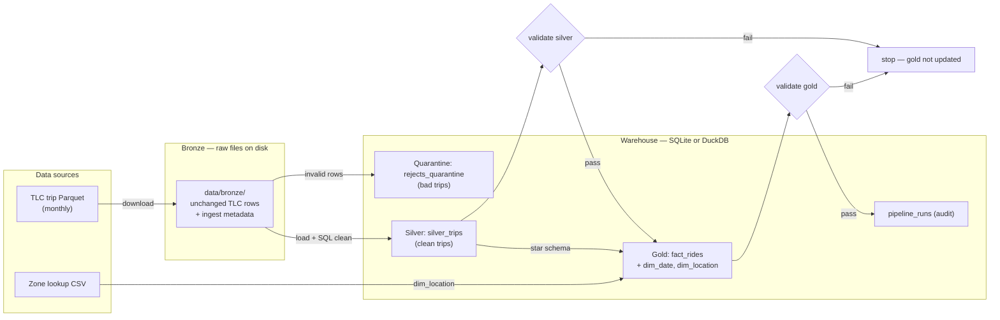

# NYC Taxi ETL

Batch pipeline that turns **raw NYC TLC trip files** into **clean, analytics-ready tables** using the **medallion architecture** (bronze → silver → gold).

Linear orchestration via `pipeline.run_partition()`; storage is swappable (SQLite or DuckDB) through `make_warehouse()`.


| Read this if you want… | Section |
|------------------------|---------|
| Run it now | [Quick start](#quick-start) |
| Why it exists | [Problem](#problem-we-solve) |
| Architecture & diagrams | [`docs/DESIGN.md`](docs/DESIGN.md) |
| Layers, flow, code map | [How it works](#how-it-works) |
| CLI vs Airflow (`dags/`) | [Orchestration](#orchestration--how-and-where-runs-start) |
| Dirty vs clean rows | [Example walkthrough](#example-walkthrough) |
| Validation gates (`validate.py`) | [Validation gates](#validation-gates-validatepy) |
| Warehouse backend & SQL dialect | [Backend and dialect](#warehouse-backend-and-sql-dialect) |
| Column & table definitions | [Technical reference](#technical-reference) |
| Regenerate diagram images | [Workflow diagrams](#workflow-diagrams) |

---

## Quick start

From project root (`nyc-taxi-etl/`). Python 3.10+; network required on first download.

Both scripts download the same TLC files. **`download_data.py`** only writes raw files under `data/bronze/`. **`run_pipeline.py`** does that too, then loads cleaned and analytics tables into `warehouse/taxi.db` and a log under `logs/`.

### Where outputs go

After a full pipeline run (`run_pipeline.py`), you get:

| What gets created | Where to find it |
|-------------------|------------------|
| **Raw trip file** — unchanged TLC Parquet for one month | `data/bronze/trips/year=YYYY/month=MM/yellow_tripdata_YYYY-MM.parquet` |
| **Zone lookup** — borough/zone names for location IDs (downloaded once) | `data/bronze/reference/taxi_zone_lookup.csv` |
| **Cleaned trips** (`silver_trips`) and **rejected rows** (`rejects_quarantine`) | SQLite file `warehouse/taxi.db` |
| **Analytics tables** — `fact_rides`, `dim_date`, `dim_location` | same file: `warehouse/taxi.db` |
| **Run history** — row counts, status, validation results (`pipeline_runs`) | same file: `warehouse/taxi.db` |
| **Text log** for this run | `logs/pipeline_*.log` |

`download_data.py` only creates the first two rows (raw files). DuckDB: set `backend = "duckdb"` and `path = "warehouse/taxi.duckdb"` in `config.toml` — same table names, different file.

### One-time setup

```bash
cd nyc-taxi-etl
python3 -m venv .venv
source .venv/bin/activate          # Windows: .venv\Scripts\activate
pip install -r requirements.txt
```

### Run pipeline (download + transform)

```bash
source .venv/bin/activate
python scripts/run_pipeline.py --year 2024 --month 5
```

**Expect (~4 min, SQLite, 2024-05):** `status=success ... silver=3663844 gold=3663844`

Re-run with bronze already on disk:

```bash
python scripts/run_pipeline.py --year 2024 --month 5 --skip-download
```

Download bronze only:

```bash
python scripts/download_data.py --year 2024 --month 5
```

**`run_pipeline.py` flags:** `--year`, `--month` (required); `--skip-download` (use existing bronze).

### Verify

```bash
sqlite3 warehouse/taxi.db "SELECT status, year, month, silver_rows, gold_rows, quarantine_rows
FROM pipeline_runs ORDER BY started_at DESC LIMIT 1;"
```

```bash
sqlite3 warehouse/taxi.db "SELECT validation_json FROM pipeline_runs ORDER BY started_at DESC LIMIT 1;"
```

`validation_json` is written at the end of each run (success or failure). It stores the silver and gold quality-gate results as JSON — not read back by the pipeline; for manual inspection and debugging only. See [`pipeline_runs` → `validation_json`](#pipeline_runs-audit).

```bash
sqlite3 warehouse/taxi.db "SELECT COUNT(*) FROM fact_rides WHERE year=2024 AND month=5;"
```

### Optional: DuckDB

Edit `config.toml`, then run the same pipeline command:

```toml
[warehouse]
backend = "duckdb"
path = "warehouse/taxi.duckdb"
```

---

## Problem we solve

NYC publishes **millions of taxi trips per month** as Parquet files. Useful, but not ready for reporting:

- **Dirty rows** — null pickup, negative fares, dropoff before pickup
- **Wrong shape** — wide trip files, not organized for dashboards
- **No quality gate** — bad data can reach analytics silently
- **No run audit** — reruns need status, counts, and validation history

This project is a **production-shaped batch ETL** (laptop-only) that:

1. Saves a **bronze** copy of the raw file (unchanged trips + ingest metadata)
2. **Cleans** valid trips into **silver** and sends bad rows to **quarantine**
3. Builds **gold** tables for analytics (star schema)
4. **Fails the run** if validation thresholds break
5. Records every run in `pipeline_runs` and `logs/`

**Not in scope:** real-time streaming, a public API, or Airflow inside core code. Optional scheduling lives in `dags/` — see [Orchestration](#orchestration--how-and-where-runs-start).

---

## How it works

### Medallion layers

Industry pattern: data moves through **three quality stages**. Names are standard data-engineering jargon — here is what they mean **in this project**.

| Layer | Plain English | What it is here | Where it lives |
|-------|---------------|-----------------|----------------|
| **Bronze** | Save what the city gave us | Exact TLC Parquet rows + `_source_file`, `_ingested_at`, `_run_id`. **No cleaning.** | `data/bronze/` on disk |
| **Silver** | Keep only valid trips | Renamed columns, derived `trip_duration_minutes`, date parts, partition `year`/`month` | `silver_trips` |
| **Gold** | Shape for reports and SQL | Star schema: `fact_rides` + `dim_date` + `dim_location` | `fact_rides`, `dim_*` |
| **Quarantine** | Park bad rows | Rows that failed silver rules | `rejects_quarantine` |

**Star schema (gold):** `fact_rides` (one row per trip, numeric measures) joined to `dim_date` (when) and `dim_location` (where). That is the layout BI tools and SQL expect.

### Pipeline flow



| Step | What happens | Code / output |
|------|----------------|---------------|
| 1 | Download TLC trip Parquet (+ zone CSV once) | `ingest.py` → `data/bronze/` |
| 2 | Land bronze — raw trips + ingest metadata | Parquet on disk |
| 3 | Silver — keep valid rows, quarantine bad rows | `transform.build_silver` → `silver_trips`, `rejects_quarantine` |
| 4 | Validate silver — row count, null checks | `validate.py` — fail stops pipeline |
| 5 | Gold — star schema (facts + date/location dims) | `transform.build_gold` + zone CSV → `fact_rides`, `dim_*` |
| 6 | Validate gold — row count, location FKs | `validate.py` |
| 7 | Audit — log counts, status, validation results | `pipeline_runs` (`validation_json`) + `logs/` |

### Validation gates (`validate.py`)

**Not the same as silver row cleaning.** During `build_silver`, bad trips are filtered per row (`transform_sql.valid_where` → `rejects_quarantine`). **`validate.py` runs after** silver and gold are loaded and checks the **whole partition** (one year/month). Implemented in `src/taxi_etl/validate.py`; called from `pipeline.run_partition()`.

| When | Function | If any check fails |
|------|----------|-------------------|
| After `build_silver` | `validate_silver` | Run stops — **gold is not built** |
| After `build_gold` | `validate_gold` | Run marked `failed` |

**Silver gate** (`validate_silver`):

| Check | Rule | Config key |
|-------|------|------------|
| `silver_min_rows` | `silver_trips` count for partition ≥ threshold | `min_rows_per_month` (default 1000) |
| `silver_null_pickup_pct` | % of silver rows with null `tpep_pickup_datetime` ≤ threshold | `max_null_pickup_pct` (default 0.01) |

**Gold gate** (`validate_gold`):

| Check | Rule | Config key |
|-------|------|------------|
| `gold_min_rows` | `fact_rides` count for partition ≥ threshold | `min_rows_per_month` |
| `gold_location_fks` | No `fact_rides` row with pickup/dropoff `location_id` missing from `dim_location` | (no config — must be 0 orphans) |

Thresholds in `config.toml`:

```toml
[validation]
max_null_pickup_pct = 0.01
min_rows_per_month = 1000
```

On failure, results are written to `pipeline_runs.validation_json` (see [Technical reference](#pipeline_runs-audit)). The pipeline does not read that column back.

### Orchestration — how and where runs start

There is **one ETL implementation**: `pipeline.run_partition()` in `src/taxi_etl/pipeline.py`. It runs all steps in order inside a **single Python process** (download → silver → validate → gold → validate → audit). Nothing in `src/taxi_etl/` imports Airflow.

#### Default: run from your terminal

You do **not** need Airflow or the `dags/` folder for local runs. From project root:

```text
Your terminal (project root)
    └── python scripts/run_pipeline.py --year 2024 --month 5
            └── pipeline.run_partition()   ← orchestrator; all ETL steps here
                    └── ingest → transform → validate → warehouse/taxi.db + logs/
```

| Piece | Where it runs | Role |
|-------|----------------|------|
| **`scripts/run_pipeline.py`** | Your laptop, in the terminal | Parses `--year` / `--month`, loads `config.toml`, calls `run_partition()` |
| **`pipeline.run_partition()`** | Same Python process as the CLI | **Orchestrator** — calls `ingest`, `transform`, `validate` in sequence |
| **`scripts/download_data.py`** | Same (terminal) | Download only; does **not** call `run_partition()` |

#### What is `dags/`? (optional — skip if you only use the CLI)

**`dags/`** is a folder for **[Apache Airflow](https://airflow.apache.org/)** workflow definitions. Airflow looks for Python files here and loads them as **DAGs** (**D**irected **A**cyclic **G**raphs — a named workflow: what runs, in what order, on what schedule).

| | |
|--|--|
| **In this repo** | One file: `dags/taxi_monthly_dag.py` |
| **What it defines** | DAG id `taxi_monthly_etl` with **one task** that runs the same CLI as above |
| **What it does *not* do** | No ETL logic — no ingest, transform, or validate code |
| **When you need it** | Only if you want Airflow’s scheduler or web UI to trigger runs for you |
| **When you can ignore it** | Always, if you run `scripts/run_pipeline.py` yourself |

Airflow is **not** installed by `requirements.txt`. It runs as a **separate service** on your machine (or a server). The DAG file only tells Airflow to shell out:

```text
Airflow (scheduler + web UI — separate install)
    └── reads dags/taxi_monthly_dag.py
            └── BashOperator: cd <ROOT> && .venv/bin/python scripts/run_pipeline.py ...
                    └── pipeline.run_partition()   ← same code path as a manual terminal run
```

**Airflow layout in this repo** (separate from ETL `.venv`):

| Path | Role |
|------|------|
| `.venv-airflow/` | Airflow install (Python 3.13) — gitignored |
| `airflow/` | `AIRFLOW_HOME` — `airflow.db`, config, runtime logs — gitignored |
| `dags/` | DAG files (tracked); `dags_folder` points here |
| `.venv/` | ETL env — the DAG subprocess uses this to run `run_pipeline.py` |

**To use Airflow:**

1. One-time install (from project root): create `.venv-airflow` with Python 3.10–3.13 and `pip install apache-airflow==3.1.1` (with constraints file — see [Airflow docs](https://airflow.apache.org/docs/apache-airflow/stable/installation/installing-from-pypi.html)).
2. Init DB: `export AIRFLOW_HOME="$(pwd)/airflow"` then `.venv-airflow/bin/airflow db migrate`.
3. Start UI + scheduler: `./scripts/start_airflow.sh` (or `airflow standalone` with `AIRFLOW_HOME` set).
4. Open the URL printed in the terminal (default port **8080**). Log in with the admin password `standalone` prints on first start.
5. Unpause DAG `taxi_monthly_etl`, trigger manually. Optional run config: `{"year": 2024, "month": 5}` (`schedule=None` until you set a cron).

**Storage:** `make_warehouse()` — SQLite default or DuckDB via `config.toml`. See [Backend and dialect](#warehouse-backend-and-sql-dialect).

### Warehouse backend and SQL dialect

Two related ideas: **which database you use** (backend) and **which SQL syntax transforms generate** (dialect).

| Term | Where it lives | Meaning in this project |
|------|----------------|-------------------------|
| **backend** | `config.toml` → `AppConfig.warehouse_backend` | User choice: `sqlite` (default) or `duckdb` |
| **dialect** | `warehouse.dialect` on each warehouse class | Same value as backend — tells `transform_sql.py` which SQL wording to emit |

**How backend is chosen** — you set it in config; the factory picks the implementation:

```toml
[warehouse]
backend = "sqlite"   # sqlite | duckdb
path = "warehouse/taxi.db"
```

```text
config.toml [warehouse] backend
    → load_config() → AppConfig.warehouse_backend
    → make_warehouse() in warehouses/warehouse_factory.py
        → SqliteWarehouse  (dialect = "sqlite")  or  DuckdbWarehouse  (dialect = "duckdb")
```

**What changes between backends**

| | SQLite (default) | DuckDB (optional) |
|--|------------------|-------------------|
| **File** | `warehouse/taxi.db` | `warehouse/taxi.duckdb` (typical) |
| **Dependency** | stdlib `sqlite3` | `duckdb` package |
| **Tables** | Same names (`silver_trips`, `fact_rides`, …) | Same logical schema |
| **SQL in transforms** | `strftime`, `datetime`, `REAL` | `EXTRACT`, `datediff`, `DOUBLE`, `TIMESTAMP` |

The table layout is defined once in `schema.py` (`ddl_sqlite()` / `ddl_duckdb()`). **Dialect differences are isolated in `transform_sql.py`** — `transform.py` calls `silver_select(dialect)`, `valid_where(dialect)`, etc., so it does not branch on backend itself.

```text
transform.build_silver() / build_gold()
    → dialect = warehouse.dialect
    → transform_sql.silver_select(..., dialect)   # returns SQL string
    → warehouse.execute(...)
```

**Plain language:** “backend” = which warehouse engine you configured. “dialect” = that engine’s SQL flavor, used when building transform SQL. In this repo they are always the same string (`"sqlite"` or `"duckdb"`).

*Dialect* is standard database terminology (SQL variant per engine). If it feels abstract, read it as **backend SQL syntax**.

### Data inputs (summary)

Two files from [NYC TLC Trip Record Data](https://www.nyc.gov/site/tlc/about/tlc-trip-record-data.page) (URLs in `config.toml`):

| Source | File | Role |
|--------|------|------|
| TLC trip Parquet | `data/bronze/trips/year=YYYY/month=MM/yellow_tripdata_YYYY-MM.parquet` | Bronze — one row per trip (~millions/month) |
| Zone lookup CSV | `data/bronze/reference/taxi_zone_lookup.csv` | Reference — builds gold `dim_location` (~265 zones) |

```text
Trip row:  PULocationID = 161, DOLocationID = 229   (just numbers)
Zone CSV:  161 → Manhattan / Midtown Center
           229 → Queens / LaGuardia Airport
```

Full column definitions: [Technical reference](#technical-reference).

---

## Example walkthrough

Real **2024-05** runs: ~**3.72M** bronze → ~**3.66M** silver → ~**60k** quarantined. Three fictional rows show what fails and which layer each row reaches.

### Silver row cleaning (`transform.py` / `transform_sql.py`)

Per-row rules applied during `build_silver` — **not** `validate.py`. Failed rows go to `rejects_quarantine`.

| Rule | Column(s) | Fails when |
|------|-----------|------------|
| Pickup exists | `tpep_pickup_datetime` | `NULL` |
| Dropoff exists | `tpep_dropoff_datetime` | `NULL` |
| Pickup zone valid | `PULocationID` | `NULL` or `≤ 0` |
| Fare non-negative | `fare_amount` | `NULL` or `< 0` |
| Distance non-negative | `trip_distance` | `NULL` or `< 0` |
| Time order | pickup vs dropoff | dropoff **before** pickup |

Fail any rule → `rejects_quarantine`. Pass all → `silver_trips`, then `fact_rides` after gold build.

### Step 1 — Bronze (raw input)

File: `data/bronze/trips/year=2024/month=05/yellow_tripdata_2024-05.parquet`  
Ingest copies Parquet and adds `_source_file`, `_ingested_at`, `_run_id`. **No cleaning.**

| Trip | VendorID | tpep_pickup_datetime | tpep_dropoff_datetime | trip_distance | PULocationID | DOLocationID | fare_amount | Verdict |
|------|----------|----------------------|------------------------|---------------|--------------|--------------|-------------|---------|
| **A** | 1 | 2024-05-15 14:32:10 | 2024-05-15 14:48:55 | 3.2 | 161 | 229 | 14.5 | **Clean** |
| **B** | 2 | 2024-05-15 09:10:00 | 2024-05-15 09:25:00 | 2.1 | 162 | 230 | **-5.0** | **Dirty** — `fare_amount < 0` |
| **C** | 1 | 2024-05-15 18:00:00 | **2024-05-15 17:45:00** | 1.0 | 161 | 229 | 12.0 | **Dirty** — dropoff before pickup |

### Step 2 — Silver (clean vs quarantine)

SQL in `transform.py` applies the rules above.

**Valid row (Trip A) — transformations:**

| Transformation | Before (bronze) | After (silver) |
|----------------|-----------------|----------------|
| Rename columns | `VendorID`, `PULocationID` | `vendor_id`, `pulocation_id` |
| Derive duration | pickup 14:32, dropoff 14:48 | `trip_duration_minutes = 16` |
| Derive date parts | pickup timestamp | `pickup_hour = 14`, `pickup_dow = 3`, … |
| Partition keys | (from pipeline) | `year = 2024`, `month = 5`, `run_id = …` |

**Trip A → `silver_trips`:**

| vendor_id | tpep_pickup_datetime | pulocation_id | dolocation_id | fare_amount | trip_duration_minutes | pickup_hour | year | month |
|-----------|----------------------|---------------|---------------|-------------|----------------------|-------------|------|-------|
| 1 | 2024-05-15 14:32:10 | 161 | 229 | 14.5 | 16 | 14 | 2024 | 5 |

**Dirty rows → `rejects_quarantine`:**

| Trip | fare_amount | tpep_dropoff_datetime | reject_reason |
|------|-------------|------------------------|---------------|
| **B** | -5.0 | 09:25:00 | `invalid_pickup,dropoff,fare,distance,or_time_order` |
| **C** | 12.0 | 17:45:00 (before pickup) | same label |

**Validate silver** (full month): min row count, max null-pickup %. Fail → pipeline stops; gold not updated.

### Step 3 — Gold (star schema)

Zone names from `taxi_zone_lookup.csv`.

**`dim_location`:**

| location_id | borough | zone_name |
|-------------|---------|-----------|
| 161 | Manhattan | Midtown Center |
| 229 | Queens | LaGuardia Airport |

**`dim_date`** (from Trip A pickup): `date_key = YYYYMMDD × 100 + hour` → `2024051514`

| date_key | pickup_date | hour | day_of_week |
|----------|-------------|------|-------------|
| 2024051514 | 2024-05-15 | 14 | 3 (Wed) |

**`fact_rides`** (Trip A only; B and C were quarantined):

| date_key | pickup_location_id | dropoff_location_id | fare_amount | trip_duration_minutes |
|----------|-------------------|----------------------|-------------|----------------------|
| 2024051514 | 161 → Midtown | 229 → LaGuardia | 14.5 | 16 |

**Validate gold:** min row count, no orphan location FKs. Fail → run marked **failed**.

### Step 4 — Run audit

Full-month example:

| run_id | year | month | status | bronze_rows | silver_rows | quarantine_rows | gold_rows |
|--------|------|-------|--------|-------------|-------------|-----------------|-----------|
| `9cf2cb2f-…` | 2024 | 5 | success | 3723833 | 3663844 | 59989 | 3663844 |

Example analytics on gold:

```sql
SELECT d.pickup_date, d.hour, l.zone_name, COUNT(*) AS trips, AVG(f.fare_amount) AS avg_fare
FROM fact_rides f
JOIN dim_date d ON f.date_key = d.date_key
JOIN dim_location l ON f.pickup_location_id = l.location_id
WHERE f.year = 2024 AND f.month = 5
GROUP BY 1, 2, 3
ORDER BY trips DESC
LIMIT 10;
```

---

## Technical reference

### TLC trip Parquet — columns

**One row = one completed yellow taxi trip.** Parquet is columnar and efficient for large batches.

#### From TLC (stored in bronze)

| Column | Type (typical) | Meaning |
|--------|----------------|---------|
| `VendorID` | integer | Meter vendor: `1` = Creative Mobile Technologies, `2` = VeriFone |
| `tpep_pickup_datetime` | timestamp | Meter on (passenger pickup) |
| `tpep_dropoff_datetime` | timestamp | Meter off (dropoff) |
| `passenger_count` | float | Passengers (0–6); `0` often means unknown |
| `trip_distance` | float | Trip length in **miles** |
| `RatecodeID` | integer | Fare rate type (standard, JFK, Newark, etc.) |
| `store_and_fwd_flag` | string | `Y` if trip held in vehicle memory before sending to TLC |
| `PULocationID` | integer | **Pickup zone ID** — join to zone CSV (`LocationID`) |
| `DOLocationID` | integer | **Dropoff zone ID** — join to zone CSV |
| `payment_type` | integer | `1` credit card, `2` cash, `3` no charge, `4` dispute, etc. |
| `fare_amount` | float | Base fare ($) before extras/tips/tolls |
| `extra` | float | Miscellaneous extras and surcharges |
| `mta_tax` | float | MTA tax ($0.50) |
| `tip_amount` | float | Tip ($) — often $0 for cash |
| `tolls_amount` | float | Tolls ($) |
| `improvement_surcharge` | float | Improvement surcharge ($0.30) |
| `total_amount` | float | Total charged to passenger ($) |
| `congestion_surcharge` | float | Congestion surcharge ($2.50) |
| `Airport_fee` | float | Airport access fee ($1.25) when applicable |
| `cbd_congestion_fee` | float | Manhattan CBD congestion fee (newer files) |

> TLC may add columns over time. Bronze keeps **all columns** from the file; silver selects a subset.

**Used heavily in this pipeline:** pickup/dropoff times, `PULocationID`, `trip_distance`, `fare_amount` (validation), plus fields copied into silver/gold.

**In file but not copied to silver:** e.g. `RatecodeID`, `extra`, `mta_tax`, `tolls_amount`, surcharges — still in bronze Parquet if needed later.

#### Added at ingest (bronze metadata)

| Column | Meaning |
|--------|---------|
| `_source_file` | Parquet filename (e.g. `yellow_tripdata_2024-05.parquet`) |
| `_ingested_at` | UTC timestamp when this run landed the file |
| `_run_id` | UUID of the pipeline run (ties rows to `pipeline_runs`) |

### Zone lookup CSV — columns

**One row = one taxi zone** (~265 locations). Trip files store numeric IDs; this file supplies names for gold `dim_location`.

**Geography:** NYC → **boroughs** (large areas) → **zones** (neighborhoods within a borough).

| NYC borough | Plain English |
|-------------|---------------|
| **Manhattan** | Core island — Midtown, downtown |
| **Brooklyn** | East of Manhattan, across the East River |
| **Queens** | East of Manhattan; JFK and LaGuardia airports |
| **Bronx** | North of Manhattan |
| **Staten Island** | Southwest, separated by water |

Example rows:

| LocationID | Borough | Zone | service_zone |
|------------|---------|------|--------------|
| 161 | Manhattan | Midtown Center | Yellow Zone |
| 229 | Queens | LaGuardia Airport | Yellow Zone |
| 11 | Brooklyn | Bath Beach | Boro Zone |
| 1 | EWR | Newark Airport | EWR |

| Column (CSV header) | Maps to `dim_location` | Meaning |
|---------------------|------------------------|---------|
| `LocationID` | `location_id` | Zone ID — matches `PULocationID` / `DOLocationID` |
| `Borough` | `borough` | NYC borough, or `EWR` / `Unknown` |
| `Zone` | `zone_name` | Neighborhood within the borough |
| `service_zone` | `service_zone` | TLC fare rules (Yellow Zone, Boro Zone, EWR) |

Not used for silver cleaning — loaded when building gold.

### Warehouse tables — columns

#### `silver_trips`

| Column | Source / rule |
|--------|----------------|
| `vendor_id` | From `VendorID` |
| `tpep_pickup_datetime`, `tpep_dropoff_datetime` | Unchanged; must pass validation |
| `passenger_count`, `trip_distance` | From TLC; distance must be ≥ 0 |
| `pulocation_id`, `dolocation_id` | From `PULocationID`, `DOLocationID` |
| `payment_type`, `fare_amount`, `tip_amount`, `total_amount` | From TLC |
| `trip_duration_minutes` | **Derived:** minutes between pickup and dropoff |
| `pickup_year`, `pickup_month`, `pickup_day`, `pickup_hour`, `pickup_dow` | **Derived** from pickup (`dow` 0=Sunday) |
| `year`, `month` | Pipeline partition (e.g. 2024, 5) |
| `run_id` | Pipeline run UUID |
| `_source_file`, `_ingested_at` | Lineage from bronze |

#### `rejects_quarantine`

Same trip-shaped columns as staging, plus `reject_reason` (fixed label for any rule failure).

#### `dim_location` (gold)

| Column | Meaning |
|--------|---------|
| `location_id` | Primary key; matches zone `LocationID` |
| `borough`, `zone_name`, `service_zone` | From CSV |

Unknown zone IDs get placeholder rows (`Unknown` / `Unknown`) so gold FK checks pass.

#### `dim_date` (gold)

| Column | Meaning |
|--------|---------|
| `date_key` | Surrogate key: `YYYYMMDD × 100 + hour` (e.g. `2024051514`) |
| `pickup_date` | Calendar date of pickup |
| `year`, `month`, `day`, `hour`, `day_of_week` | Parts of pickup timestamp |

#### `fact_rides` (gold)

| Column | Meaning |
|--------|---------|
| `fact_ride_id` | Surrogate primary key |
| `date_key` | FK → `dim_date` |
| `pickup_location_id`, `dropoff_location_id` | FK → `dim_location` |
| `vendor_id`, `passenger_count`, `trip_distance` | Trip attributes |
| `fare_amount`, `tip_amount`, `total_amount`, `trip_duration_minutes`, `payment_type` | Measures |
| `year`, `month`, `run_id` | Partition and lineage |

#### `pipeline_runs` (audit)

| Column | Meaning |
|--------|---------|
| `run_id` | Primary key |
| `year`, `month` | Partition processed |
| `status` | `running`, `success`, or `failed` |
| `started_at`, `finished_at` | Run timestamps |
| `bronze_rows`, `silver_rows`, `quarantine_rows`, `gold_rows` | Row counts |
| `validation_json` | Silver/gold quality-gate results (JSON) — see below |
| `error_message` | Set if run failed |

**`validation_json`** — written by `pipeline.run_partition()` when a run finishes (success or failure). The pipeline does **not** read this column back; it is audit data for operators.

| When set | Contents |
|----------|----------|
| Success | Both silver and gold checks: `{"silver": {...}, "gold": {...}}` |
| Validation failure | The layer that failed (silver only, or silver + partial gold) |
| Other failure | Whatever checks completed before the error |

Each layer is a `ValidationResult`: `passed` (bool) plus a `checks` list. Every check has `name`, `passed`, and `detail`. Full rule list: [Validation gates](#validation-gates-validatepy).

| Check | Layer | What it verifies |
|-------|-------|------------------|
| `silver_min_rows` | Silver | `silver_rows` ≥ `min_rows_per_month` in config |
| `silver_null_pickup_pct` | Silver | Null pickup timestamps ≤ `max_null_pickup_pct` |
| `gold_min_rows` | Gold | `gold_rows` ≥ `min_rows_per_month` |
| `gold_location_fks` | Gold | No orphan `pickup_location_id` / `dropoff_location_id` in `fact_rides` |

Example (abbreviated):

```json
{
  "silver": {
    "passed": true,
    "checks": [
      {"name": "silver_min_rows", "passed": true, "detail": "silver_rows=2847291, min=1000"},
      {"name": "silver_null_pickup_pct", "passed": true, "detail": "null_pickup_pct=0.0000, max=0.01"}
    ]
  },
  "gold": {
    "passed": true,
    "checks": [
      {"name": "gold_min_rows", "passed": true, "detail": "gold_rows=2847291, min=1000"},
      {"name": "gold_location_fks", "passed": true, "detail": "orphan_location_fks=0"}
    ]
  }
}
```

Inspect after a run:

```bash
sqlite3 warehouse/taxi.db "SELECT validation_json FROM pipeline_runs ORDER BY started_at DESC LIMIT 1;"
```

### Config (`config.toml`)

```toml
[warehouse]
backend = "sqlite"   # sqlite | duckdb
path = "warehouse/taxi.db"
```

### Optional later

- **Streamlit** dashboard (`dashboard/streamlit_app.py`)
- **Airflow + `dags/`** — optional scheduler; one DAG file subprocesses `run_pipeline.py`. See [What is `dags/`?](#what-is-dags-optional--skip-if-you-only-use-the-cli) under Orchestration.

---

## Workflow diagrams

All diagrams and architecture detail: [`docs/DESIGN.md`](docs/DESIGN.md).
