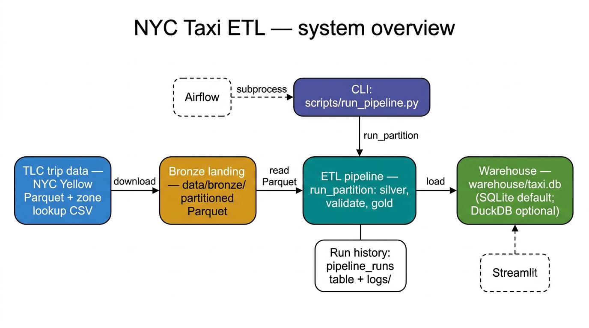
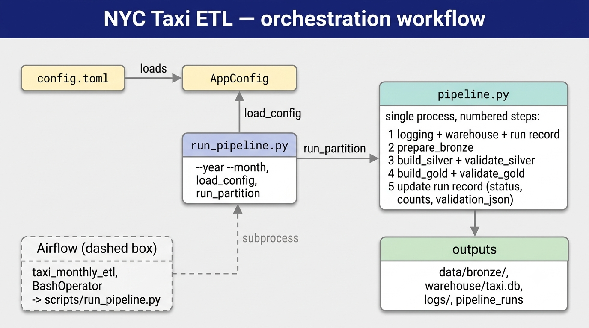
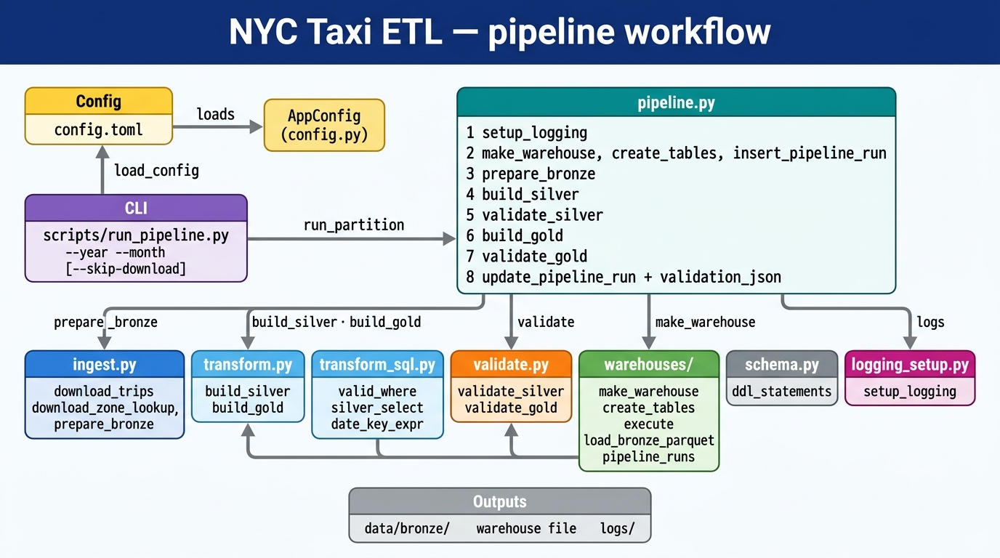
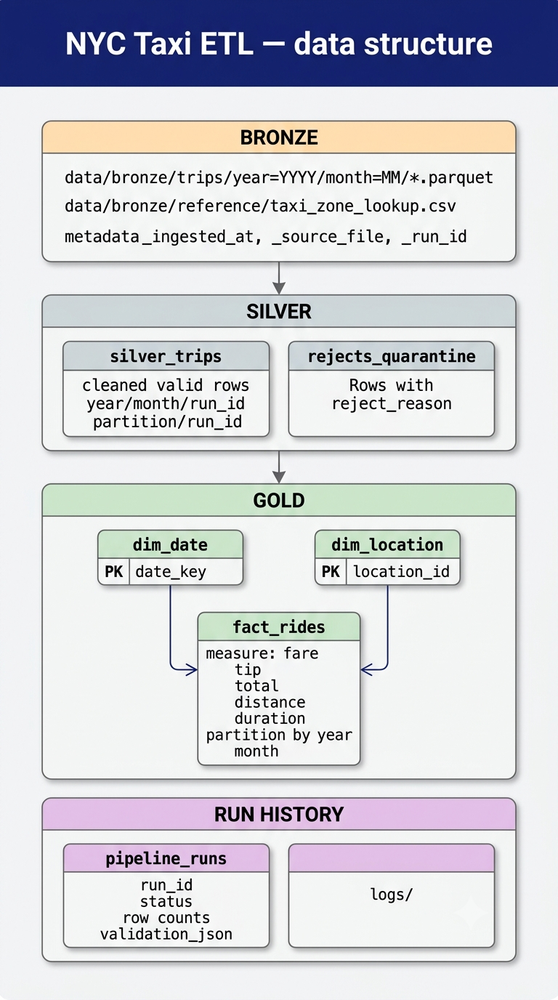
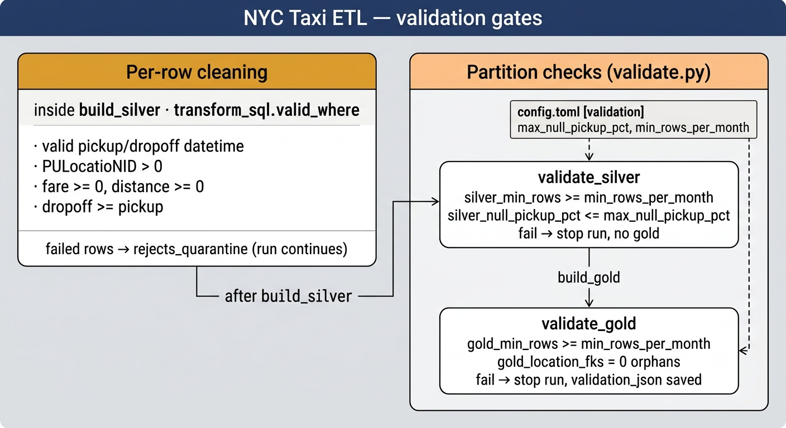
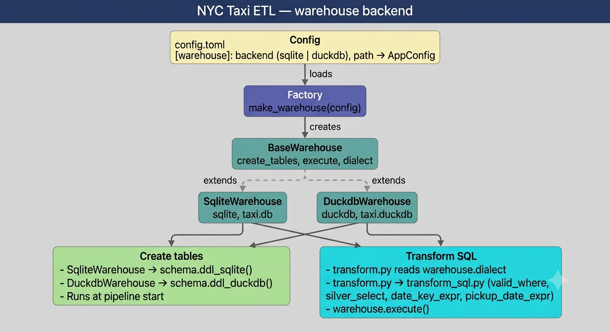

# NYC Taxi ETL — design

Architecture for the batch ETL pipeline: medallion layers, linear orchestration, swappable warehouse, validation gates.

Config: `config.toml` at project root. PRD: [`../prd_3.md`](../prd_3.md).

---

## Rules

- **One orchestrator:** `pipeline.run_partition()` in `src/taxi_etl/pipeline.py` — read top to bottom.
- **CLI entry:** `scripts/run_pipeline.py` loads config and calls `run_partition()`.
- **Airflow optional:** `dags/` subprocesses the CLI — no ETL logic in Airflow, no Airflow imports in `taxi_etl`.
- **Factory at one seam:** `make_warehouse()` — SQLite default, DuckDB optional. Dialect-specific SQL in `transform_sql.py`.
- **Two kinds of quality control:** row cleaning during `build_silver` (`transform_sql.valid_where`) vs partition gates in `validate.py`.

---

## System overview

TLC Parquet + zone CSV → bronze on disk → ETL → warehouse tables. CLI triggers each run; optional Airflow subprocesses the same CLI.



| Piece | Role |
|-------|------|
| **Bronze** | Immutable Parquet + ingest metadata on disk |
| **ETL** | `run_partition()` — silver, validate, gold, validate, audit |
| **Warehouse** | `silver_trips`, `fact_rides`, dims, `pipeline_runs` |
| **CLI** | `scripts/run_pipeline.py` |
| **Airflow** (optional) | Scheduler — BashOperator to CLI only |

---

## Orchestration

There is a single ETL implementation. Airflow does not import `taxi_etl`.



| Entry | What runs |
|-------|-----------|
| **Terminal** | `python scripts/run_pipeline.py --year YYYY --month MM` |
| **Airflow** | DAG `taxi_monthly_etl` → same CLI via subprocess |

Both paths call `pipeline.run_partition()` in one Python process.

| Piece | Role |
|-------|------|
| **`scripts/run_pipeline.py`** | Parses `--year` / `--month`, loads `config.toml`, calls `run_partition()` |
| **`pipeline.run_partition()`** | Orchestrator — ingest → transform → validate in one process |
| **`scripts/download_data.py`** | Download only; does **not** call `run_partition()` |

### Airflow (optional)

**`dags/`** holds [Apache Airflow](https://airflow.apache.org/) DAG definitions. In this repo: one file, `dags/taxi_monthly_dag.py`, defining DAG `taxi_monthly_etl` with **one task** that shells out to the same CLI. No ETL logic in the DAG.

Airflow is **not** in `requirements.txt`. Layout:

| Path | Role |
|------|------|
| `.venv-airflow/` | Airflow install (Python 3.10–3.13) — gitignored |
| `airflow/` | `AIRFLOW_HOME` — `airflow.db`, config, runtime logs — gitignored |
| `dags/` | DAG files (tracked) |
| `.venv/` | ETL env — the DAG subprocess uses this |

**Setup:**

1. Create `.venv-airflow` and `pip install apache-airflow==3.1.1` (see [Airflow install docs](https://airflow.apache.org/docs/apache-airflow/stable/installation/installing-from-pypi.html)).
2. `export AIRFLOW_HOME="$(pwd)/airflow"` then `.venv-airflow/bin/airflow db migrate`.
3. `./scripts/start_airflow.sh` (or `airflow standalone` with `AIRFLOW_HOME` set).
4. Open the URL printed (default port **8080**). Unpause DAG `taxi_monthly_etl`, trigger manually. Optional config: `{"year": 2024, "month": 5}`.

---

## Pipeline workflow

Linear module flow — no factory packages beyond `warehouses/`.



| Step | What happens | Code / output |
|------|----------------|---------------|
| 1 | Download TLC trip Parquet (+ zone CSV once) | `ingest.py` → `data/bronze/` |
| 2 | Land bronze — raw trips + ingest metadata | Parquet on disk |
| 3 | Silver — keep valid rows, quarantine bad rows | `transform.build_silver` → `silver_trips`, `rejects_quarantine` |
| 4 | Validate silver — row count, null checks | `validate.py` — fail stops pipeline |
| 5 | Gold — star schema (facts + date/location dims) | `transform.build_gold` → `fact_rides`, `dim_*` |
| 6 | Validate gold — row count, location FKs | `validate.py` |
| 7 | Audit — log counts, status, validation results | `pipeline_runs` + `logs/` |

| Module | Role |
|--------|------|
| `ingest.py` | `prepare_bronze`, downloads |
| `transform.py` | `build_silver`, `build_gold` |
| `transform_sql.py` | SQL fragments by `warehouse.dialect` |
| `validate.py` | `validate_silver`, `validate_gold` |
| `warehouses/` | `make_warehouse`, `create_tables`, `execute` |
| `schema.py` | `ddl_sqlite()`, `ddl_duckdb()` |

**`run_partition()` steps:**

1. `setup_logging`
2. `make_warehouse` · `create_tables` · `insert_pipeline_run`
3. `prepare_bronze`
4. `build_silver`
5. `validate_silver`
6. `build_gold`
7. `validate_gold`
8. `update_pipeline_run` + `validation_json`

---

## Data structure

Medallion layers and gold star schema. Bronze is on disk; silver/gold live in the warehouse file.



| Layer | Plain English | What it is here | Where it lives |
|-------|---------------|-----------------|----------------|
| **Bronze** | Save what the city gave us | Exact TLC Parquet rows + `_source_file`, `_ingested_at`, `_run_id`. **No cleaning.** | `data/bronze/` on disk |
| **Silver** | Keep only valid trips | Renamed columns, derived `trip_duration_minutes`, date parts, partition `year`/`month` | `silver_trips` |
| **Gold** | Shape for reports and SQL | Star schema: `fact_rides` + `dim_date` + `dim_location` | `fact_rides`, `dim_*` |
| **Quarantine** | Park bad rows | Rows that failed silver rules | `rejects_quarantine` |
| **Run history** | Audit | Row counts, status, validation JSON | `pipeline_runs`, `logs/` |

**Star schema (gold):** `fact_rides` (one row per trip) joined to `dim_date` (when) and `dim_location` (where).

### Data inputs

Two files from [NYC TLC Trip Record Data](https://www.nyc.gov/site/tlc/about/tlc-trip-record-data.page) (URLs in `config.toml`):

| Source | File | Role |
|--------|------|------|
| TLC trip Parquet | `data/bronze/trips/year=YYYY/month=MM/yellow_tripdata_YYYY-MM.parquet` | Bronze — one row per trip |
| Zone lookup CSV | `data/bronze/reference/taxi_zone_lookup.csv` | Reference — builds gold `dim_location` (~265 zones) |

```text
Trip row:  PULocationID = 161, DOLocationID = 229   (just numbers)
Zone CSV:  161 → Manhattan / Midtown Center
           229 → Queens / LaGuardia Airport
```

Column definitions: [Technical reference](#technical-reference) below.

---

## Validation gates

Row cleaning (per row, run continues) vs partition checks (whole month, fail stops run).



### Row cleaning (inside `build_silver`)

**Not** `validate.py`. Per row via `transform_sql.valid_where(dialect)`.

| Rule | Fails when |
|------|------------|
| Pickup exists | `tpep_pickup_datetime` is null |
| Dropoff exists | `tpep_dropoff_datetime` is null |
| Pickup zone valid | `PULocationID` null or ≤ 0 |
| Fare non-negative | `fare_amount` null or < 0 |
| Distance non-negative | `trip_distance` null or < 0 |
| Time order | dropoff before pickup |

Failed row → `rejects_quarantine`. Run continues.

### Partition checks (`validate.py`)

| When | Function | On failure |
|------|----------|------------|
| After silver, before gold | `validate_silver` | Run stops; gold not built |
| After gold | `validate_gold` | Run `failed`; `validation_json` saved |

**`validate_silver`:**

| Check | Rule | Config key |
|-------|------|------------|
| `silver_min_rows` | `silver_trips` count for partition ≥ threshold | `min_rows_per_month` (default 1000) |
| `silver_null_pickup_pct` | % of silver rows with null `tpep_pickup_datetime` ≤ threshold | `max_null_pickup_pct` (default 0.01) |

**`validate_gold`:**

| Check | Rule | Config key |
|-------|------|------------|
| `gold_min_rows` | `fact_rides` count for partition ≥ threshold | `min_rows_per_month` |
| `gold_location_fks` | No orphan `pickup_location_id` / `dropoff_location_id` in `fact_rides` | (no config — must be 0) |

```toml
[validation]
max_null_pickup_pct = 0.01
min_rows_per_month = 1000
```

Pipeline order: `build_silver` → `validate_silver` → `build_gold` → `validate_gold`

Walkthrough with example rows: [README — Example walkthrough](../README.md#example-walkthrough)

---

## Warehouse backend

Config picks SQLite or DuckDB. Two separate uses of the warehouse class:



| Term | Where it lives | Meaning |
|------|----------------|---------|
| **backend** | `config.toml` → `AppConfig.warehouse_backend` | User choice: `sqlite` (default) or `duckdb` |
| **dialect** | `warehouse.dialect` on each warehouse class | Same value as backend — tells `transform_sql.py` which SQL to emit |

```toml
[warehouse]
backend = "sqlite"   # sqlite | duckdb
path = "warehouse/taxi.db"
```

```text
config.toml [warehouse] backend
    → load_config() → make_warehouse()
        → SqliteWarehouse (dialect = "sqlite")  or  DuckdbWarehouse (dialect = "duckdb")
```

| | SQLite (default) | DuckDB (optional) |
|--|------------------|-------------------|
| **File** | `warehouse/taxi.db` | `warehouse/taxi.duckdb` |
| **Dependency** | stdlib `sqlite3` | `duckdb` package |
| **Tables** | Same names | Same logical schema |
| **SQL in transforms** | `strftime`, `datetime`, `REAL` | `EXTRACT`, `datediff`, `DOUBLE`, `TIMESTAMP` |

`make_warehouse(config)` → `SqliteWarehouse` or `DuckdbWarehouse` (both extend `BaseWarehouse`).

| Path | When | What |
|------|------|------|
| **Create tables** | Pipeline start | `create_tables()` → `ddl_sqlite()` or `ddl_duckdb()` in `schema.py` |
| **Transform SQL** | `build_silver` / `build_gold` | `transform.py` reads `warehouse.dialect` → `transform_sql.py` → `warehouse.execute()` |

Table layout is in `schema.py`. Dialect differences are isolated in `transform_sql.py` — `transform.py` calls `silver_select(dialect)`, `valid_where(dialect)`, etc.

---

## Technical reference

### TLC trip Parquet — columns

**One row = one completed yellow taxi trip.**

#### From TLC (stored in bronze)

| Column | Type (typical) | Meaning |
|--------|----------------|---------|
| `VendorID` | integer | Meter vendor: `1` = Creative Mobile Technologies, `2` = VeriFone |
| `tpep_pickup_datetime` | timestamp | Meter on (passenger pickup) |
| `tpep_dropoff_datetime` | timestamp | Meter off (dropoff) |
| `passenger_count` | float | Passengers (0–6); `0` often means unknown |
| `trip_distance` | float | Trip length in **miles** |
| `RatecodeID` | integer | Fare rate type (standard, JFK, Newark, etc.) |
| `store_and_fwd_flag` | string | `Y` if trip held in vehicle memory before sending to TLC |
| `PULocationID` | integer | **Pickup zone ID** — join to zone CSV (`LocationID`) |
| `DOLocationID` | integer | **Dropoff zone ID** — join to zone CSV |
| `payment_type` | integer | `1` credit card, `2` cash, `3` no charge, `4` dispute, etc. |
| `fare_amount` | float | Base fare ($) before extras/tips/tolls |
| `extra` | float | Miscellaneous extras and surcharges |
| `mta_tax` | float | MTA tax ($0.50) |
| `tip_amount` | float | Tip ($) — often $0 for cash |
| `tolls_amount` | float | Tolls ($) |
| `improvement_surcharge` | float | Improvement surcharge ($0.30) |
| `total_amount` | float | Total charged to passenger ($) |
| `congestion_surcharge` | float | Congestion surcharge ($2.50) |
| `Airport_fee` | float | Airport access fee ($1.25) when applicable |
| `cbd_congestion_fee` | float | Manhattan CBD congestion fee (newer files) |

> TLC may add columns over time. Bronze keeps **all columns** from the file; silver selects a subset.

**Used heavily in this pipeline:** pickup/dropoff times, `PULocationID`, `trip_distance`, `fare_amount`, plus fields copied into silver/gold.

#### Added at ingest (bronze metadata)

| Column | Meaning |
|--------|---------|
| `_source_file` | Parquet filename (e.g. `yellow_tripdata_2024-05.parquet`) |
| `_ingested_at` | UTC timestamp when this run landed the file |
| `_run_id` | UUID of the pipeline run (ties rows to `pipeline_runs`) |

### Zone lookup CSV — columns

**One row = one taxi zone** (~265 locations).

| Column (CSV header) | Maps to `dim_location` | Meaning |
|---------------------|------------------------|---------|
| `LocationID` | `location_id` | Zone ID — matches `PULocationID` / `DOLocationID` |
| `Borough` | `borough` | NYC borough, or `EWR` / `Unknown` |
| `Zone` | `zone_name` | Neighborhood within the borough |
| `service_zone` | `service_zone` | TLC fare rules (Yellow Zone, Boro Zone, EWR) |

Not used for silver cleaning — loaded when building gold.

### Warehouse tables — columns

#### `silver_trips`

| Column | Source / rule |
|--------|----------------|
| `vendor_id` | From `VendorID` |
| `tpep_pickup_datetime`, `tpep_dropoff_datetime` | Unchanged; must pass validation |
| `passenger_count`, `trip_distance` | From TLC; distance must be ≥ 0 |
| `pulocation_id`, `dolocation_id` | From `PULocationID`, `DOLocationID` |
| `payment_type`, `fare_amount`, `tip_amount`, `total_amount` | From TLC |
| `trip_duration_minutes` | **Derived:** minutes between pickup and dropoff |
| `pickup_year`, `pickup_month`, `pickup_day`, `pickup_hour`, `pickup_dow` | **Derived** from pickup (`dow` 0=Sunday) |
| `year`, `month` | Pipeline partition |
| `run_id` | Pipeline run UUID |
| `_source_file`, `_ingested_at` | Lineage from bronze |

#### `rejects_quarantine`

Same trip-shaped columns as staging, plus `reject_reason` (fixed label for any rule failure).

#### `dim_location` (gold)

| Column | Meaning |
|--------|---------|
| `location_id` | Primary key; matches zone `LocationID` |
| `borough`, `zone_name`, `service_zone` | From CSV |

Unknown zone IDs get placeholder rows so gold FK checks pass.

#### `dim_date` (gold)

| Column | Meaning |
|--------|---------|
| `date_key` | Surrogate key: `YYYYMMDD × 100 + hour` (e.g. `2024051514`) |
| `pickup_date` | Calendar date of pickup |
| `year`, `month`, `day`, `hour`, `day_of_week` | Parts of pickup timestamp |

#### `fact_rides` (gold)

| Column | Meaning |
|--------|---------|
| `fact_ride_id` | Surrogate primary key |
| `date_key` | FK → `dim_date` |
| `pickup_location_id`, `dropoff_location_id` | FK → `dim_location` |
| `vendor_id`, `passenger_count`, `trip_distance` | Trip attributes |
| `fare_amount`, `tip_amount`, `total_amount`, `trip_duration_minutes`, `payment_type` | Measures |
| `year`, `month`, `run_id` | Partition and lineage |

#### `pipeline_runs` (audit)

| Column | Meaning |
|--------|---------|
| `run_id` | Primary key |
| `year`, `month` | Partition processed |
| `status` | `running`, `success`, or `failed` |
| `started_at`, `finished_at` | Run timestamps |
| `bronze_rows`, `silver_rows`, `quarantine_rows`, `gold_rows` | Row counts |
| `validation_json` | Silver/gold quality-gate results (JSON) |
| `error_message` | Set if run failed |

### `validation_json`

Written by `pipeline.run_partition()` when a run finishes. The pipeline does **not** read this column back.

| When set | Contents |
|----------|----------|
| Success | Both silver and gold checks: `{"silver": {...}, "gold": {...}}` |
| Validation failure | The layer that failed |
| Other failure | Whatever checks completed before the error |

Each layer: `passed` (bool) plus a `checks` list (`name`, `passed`, `detail`).

Example (abbreviated):

```json
{
  "silver": {
    "passed": true,
    "checks": [
      {"name": "silver_min_rows", "passed": true, "detail": "silver_rows=2847291, min=1000"},
      {"name": "silver_null_pickup_pct", "passed": true, "detail": "null_pickup_pct=0.0000, max=0.01"}
    ]
  },
  "gold": {
    "passed": true,
    "checks": [
      {"name": "gold_min_rows", "passed": true, "detail": "gold_rows=2847291, min=1000"},
      {"name": "gold_location_fks", "passed": true, "detail": "orphan_location_fks=0"}
    ]
  }
}
```

### Config (`config.toml`)

```toml
[data]
bronze_dir = "data/bronze"
logs_dir = "logs"

[warehouse]
backend = "sqlite"   # sqlite | duckdb
path = "warehouse/taxi.db"

[download]
taxi_type = "yellow"
base_url = "https://d37ci6vzurychx.cloudfront.net/trip-data"
zone_lookup_url = "https://d37ci6vzurychx.cloudfront.net/misc/taxi_zone_lookup.csv"

[validation]
max_null_pickup_pct = 0.01
min_rows_per_month = 1000
```

---

## Project layout

```
nyc-taxi-etl/
├── README.md
├── docs/
│   ├── DESIGN.md
│   └── diagrams/
├── requirements.txt          # pyarrow only
├── config.toml
│
├── scripts/
│   ├── download_data.py
│   └── run_pipeline.py       # CLI → pipeline.run_partition()
│
├── src/taxi_etl/
│   ├── config.py
│   ├── pipeline.py           # linear orchestration
│   ├── pipeline_types.py     # run + validation records
│   ├── ingest.py
│   ├── transform.py          # build_silver, build_gold
│   ├── transform_sql.py      # dialect-specific SQL fragments
│   ├── validate.py
│   ├── schema.py             # table names + DDL
│   ├── warehouses/
│   │   ├── base_warehouse.py
│   │   ├── sqlite_warehouse.py
│   │   ├── duckdb_warehouse.py
│   │   └── warehouse_factory.py   # make_warehouse()
│   └── logging_setup.py
│
├── sql/                      # reference notes (logic in transform.py)
├── dags/                     # optional Airflow DAGs; subprocess to CLI
├── dashboard/                # optional Streamlit UI
│
├── data/                     # gitignored
├── warehouse/                # gitignored
└── logs/                     # gitignored
```

---

## Locked decisions (v1)

| Topic | Choice |
|-------|--------|
| Warehouse | `make_warehouse()` — SQLite default, DuckDB optional |
| Orchestration | `pipeline.run_partition()` + CLI script (Airflow subprocesses CLI) |
| Dependencies | `pyarrow` + Python stdlib |
| Tests | Manual smoke run + validation gates |
| Git | Code + config; ignore `data/`, `warehouse/`, `logs/` |

### Optional later

- **Streamlit** dashboard (`dashboard/streamlit_app.py`)
- **Airflow + `dags/`** — optional scheduler; one DAG subprocesses `run_pipeline.py`

---

## Related docs

| Doc | Contents |
|-----|----------|
| [`../README.md`](../README.md) | Quick start, example walkthrough |
